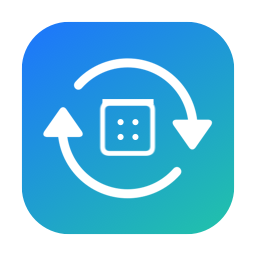
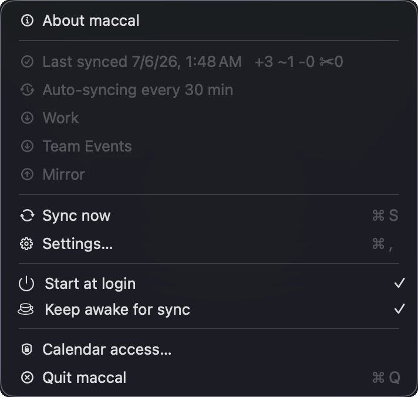

<p align="center">
  
</p>

<h1 align="center">maccal</h1>

<p align="center">
  <b>Your Mac already syncs all your calendars. maccal puts them in your terminal.</b><br>
  Google, iCloud, Exchange, CalDAV — read and write them all from the terminal: no OAuth,
  no API tokens, no network, works offline. Plus a menu-bar app that quietly mirrors
  calendars across accounts in the background.
</p>

<p align="center">
  <a href="https://github.com/ikhoon/maccal/actions/workflows/ci.yml"></a>
  
  
  
  
  
</p>

<p align="center">
  <sub>Part of the <code>mac*</code> family ·
  <a href="https://github.com/ikhoon/macmail">macmail</a> (mail) ·
  <a href="https://github.com/ikhoon/macrec">macrec</a> (meeting recorder)</sub>
</p>

<p align="center">
  
</p>

- **See your day without leaving the terminal.** `maccal agenda` prints every
  account's events in one aligned, color-coded table — online meetings flagged 💻,
  short git-style ids you can `show` / `edit` / `rm`. Instant, and it works offline.
- **Put your work calendar on your personal phone.** `maccal sync` keeps a
  **one-way mirror** across accounts — work Google → personal iCloud, or three team
  calendars → one "Mirror" — and only ever touches its own marked copies, never
  your events. The menu-bar app re-runs it in the background: set sources and a
  target once, forget it. [→ Mirror calendars across accounts](#mirror-calendars-across-accounts)
- **Automate it in one line.** `maccal add "Lunch" --start "tomorrow 12:00"
  --duration 1h` — natural-language dates, `--dry-run` preview, `--yes` for cron.
  Read, write, and sync commands all speak `--json`, and every event carries its
  meeting link — so `jq`, cron, and LLM agents can drive your calendar.
- **Private by construction.** Nothing leaves your Mac — no network calls, no
  telemetry — and maccal holds its *own* Calendar permission, so your terminal
  (and everything running in it) never gets access.

---

## Contents

- [Install](#install) · [Quick start](#quick-start) · [Mirror calendars across accounts](#mirror-calendars-across-accounts)
- [Commands](#commands): [`calendars`](#calendars) · [`agenda`](#agenda) · [`show`](#show) · [`search`](#search) · [`free`](#free) · [`add`](#add) · [`edit`](#edit) · [`rm`](#rm) · [`sync`](#sync) · [`export`/`import`](#export--import) · [`auth`](#auth) — plus the [menu-bar app reference](#menu-bar-app-reference) and [Scripting with JSON](#scripting-with-json)
- [Dates & durations](#dates--durations) · [Configuration](#configuration) · [Shell completion](#shell-completion) · [Troubleshooting](#troubleshooting) · [How it works](#how-it-works) · [Privacy](#privacy) · [Requirements](#requirements) · [Development](#development)

---

## Install

One command — the app bundles the CLI, so you get both:

```console
$ brew install --cask ikhoon/tap/maccal-app
```

That's the menu-bar sync app ([what it does](#mirror-calendars-across-accounts))
**plus** the `maccal` CLI on your `PATH`. Universal (Apple Silicon + Intel); the
Homebrew download isn't quarantined, so there's no Gatekeeper prompt. On first use
macOS pops the Calendar-access dialog — click **Allow**. That's the whole setup.

Really only want the CLI, no app?

```console
$ brew install ikhoon/tap/maccal             # CLI only
```

(Pick one — both put `maccal` on your `PATH`.)

<details>
<summary><b>Other install methods</b> — release zip · from source</summary>

#### Download from Releases

Grab `maccal-<version>-macos-universal.zip` (CLI) or
`maccal-menubar-<version>-macos-universal.zip` (app) from the **Releases** page.
For the CLI:

```console
$ unzip maccal-<version>-macos-universal.zip
$ xattr -dr com.apple.quarantine maccal.app    # not notarized — clear Gatekeeper quarantine
$ mkdir -p ~/.local/lib ~/.local/bin
$ mv maccal.app ~/.local/lib/
$ ln -s ~/.local/lib/maccal.app/Contents/MacOS/maccal ~/.local/bin/maccal
```

The `xattr` step is only needed for a manual download (the build isn't
notarized); brew and a local build don't need it.

#### From source

```console
$ git clone https://github.com/ikhoon/maccal ~/src/maccal
$ cd ~/src/maccal
$ ./install.sh
```

`install.sh` compiles a release build, packages it as a `~/.local/lib/maccal.app`
bundle (its own row in Calendar privacy settings), codesigns it with a stable
identifier, symlinks the executable to `~/.local/bin/maccal`, and installs shell
completions. Requires the Swift toolchain (`xcode-select --install`). For a
distributable universal build, use `./release.sh` (CLI) or `./package.sh` (app).
Make sure `~/.local/bin` is on your `PATH`:

```console
$ which maccal        # → /Users/you/.local/bin/maccal
$ maccal --help
```

For the **menu-bar app** from source, `./package.sh --install` builds a universal
`maccal.app`, installs it to `/Applications`, symlinks the bundled (signed) CLI to
`~/.local/bin/maccal` (it shares the app's Calendar grant), and launches it. Both
build scripts sign with a stable self-signed certificate when one is in the
keychain (set `MACCAL_SIGN_ID` to pick one explicitly, ad-hoc otherwise) — a
stable identity means the Calendar grant survives rebuilds and upgrades.

</details>

## Quick start

Everything you need for daily use. Copy, paste, adjust.

```bash
# SEE YOUR CALENDARS ────────────────────────────────────────────────────
maccal calendars                          # ● color dot · title · account · type · rw/ro
maccal calendars --writable               # only the ones you can edit

# AGENDA — what's coming up ──────────────────────────────────────────────
maccal agenda                             # next 7 days, all calendars
maccal agenda --from today --to +1d       # just today
maccal agenda --calendar Work --max 5     # one calendar, 5 rows
maccal agenda --from 2026-07-01 --to 2026-07-04   # an explicit 3-day window

# SEARCH — find events by text ───────────────────────────────────────────
maccal search standup                     # match title/location/notes, ±30 days
maccal search 1:1 --in title              # titles only
maccal search review --from today --to +7d
maccal search incident --count-only       # totals only, no rows

# SHOW one event (id comes from agenda / search) ─────────────────────────
maccal show <id>                          # full detail (notes rendered as text)
maccal show <id> --json | jq .attendees

# ADD / EDIT / RM — preview with --dry-run, commit with --yes ─────────────
maccal add "Lunch" --start "tomorrow 12:00" --duration 1h --calendar Personal --dry-run
maccal add "Lunch" --start "tomorrow 12:00" --duration 1h --calendar Personal --yes
maccal add "PTO" --start 2026-07-01 --end 2026-07-04 --all-day --calendar Personal
maccal edit <id> --location "Room 4F"     # prompts; before→after diff with --dry-run
maccal edit <id> --start "tomorrow 16:00" # end shifts to keep the duration
maccal rm <id>                            # confirms before deleting

# OPEN YOUR NEXT VIDEO CALL ──────────────────────────────────────────────
maccal agenda --json | jq -r 'select(.meetingUrl != "") | .meetingUrl' | head -1 | xargs open

# MIRROR — work → personal, so your phone sees everything ────────────────
maccal sync --from "Google/Work" --to "iCloud/Mirror" --dry-run
```

> **The last column** of `agenda` / `search` is a **short git-style id** — pass it
> to `show`, `edit`, `rm`, or `export` (it's resolved back to the event over a
> ±1-year window). On a terminal, output is an **aligned table** with short ids and
> readable dates; **piped/redirected output is raw tab-separated TSV with full ids
> and ISO dates** (script-safe). Add `--json` for NDJSON.

---

## Mirror calendars across accounts

Your work Google calendar and your personal iCloud don't know about each other —
so your phone shows half your day, and the meeting you miss is always on the
calendar you didn't check. The usual fixes hand OAuth tokens for *both* accounts
to a third-party sync service.

maccal fixes it locally. `maccal sync` keeps a **one-way mirror** of one or more
source calendars inside a target calendar — across accounts, idempotent, safe to
re-run forever:

```console
$ maccal sync --from "Google/Work" --to "iCloud/Mirror" --dry-run
would sync: Work → Mirror   +3 new  ~0 changed  -0 removed  ✂0 cancelled
  + 2026-07-07T10:00:00+09:00  Standup
  + 2026-07-07T14:00:00+09:00  Design review
  + 2026-07-08T12:00:00+09:00  Lunch
```

- **Work → personal.** Mirror your work calendar into iCloud and your phone and
  watch finally show your whole day — no MDM profile, no second calendar app.
- **Many → one.** `--from` repeats: fold several team calendars into a single
  "Mirror" calendar and point everyone at that.
- **It never eats your events.** Every mirrored copy carries a hidden marker, so
  re-runs add, update, and remove *exactly maccal's own copies* — everything else
  in the target is never a candidate, not on the first run, not on the
  thousandth. And one-way means one-way: nothing ever flows back into the source.
- **Shares the when, not the what.** By default a copy carries only the
  **title, time, and location** — meeting notes and the attendee list are never
  mirrored (opt in to the body with `--notes`; drop even the location with
  `--no-location`). What's discussed in a work meeting stays in the work account.
- **Recurring- and cancellation-aware.** A repeating source mirrors as one
  repeating event, not a copy per occurrence — and cancelled occurrences are
  cancelled in the mirror too (that's the `✂` in the tally).
- **Changed your mind? One line undoes it.** `maccal sync --reset --to Mirror`
  removes every copy maccal ever created there — and nothing else.

### Set it and forget it: the menu-bar app

<p align="center">
  
</p>

Skip the cron job. **maccal.app** runs the same sync engine on a schedule from
your menu bar: pick source calendars and a target once in **Settings…** and
background sync just starts — every 30 minutes by default, with **Start at
login** and **Keep awake for sync** one click away. The menu shows when the last
sync ran and what changed (`+2 ~1 −0`), and the icon **spins blue while a sync
is in flight**.

It's the same one-command install from [Install](#install) — the cask ships the
app **and** the CLI:

```console
$ brew install --cask ikhoon/tap/maccal-app
```

Full flags (`--since`/`--until` windows, `--notes`, `--no-delete`, `Account/*`
selectors) are in the [`sync` reference](#sync); settings and menu toggles are in
the [menu-bar app reference](#menu-bar-app-reference).

---

## Commands

| | Commands | Notes |
|---|---|---|
| **Read** | `calendars` `agenda` `show` `search` `free` | no side effects |
| **Write** | `add` `edit` `rm` | confirm by default; `--dry-run` / `--yes` |
| **Sync** | `sync` | one-way mirror into a target; idempotent |
| **Interop** | `export` `import` | iCalendar (.ics) out / in |
| **Setup** | `auth` | grant Calendar access once |

Conventions: every read/write/sync command takes `--json` (NDJSON, for `jq`;
`export` emits `.ics`, `auth`/`completions` are plain); `--calendar`
selects by title **or** identifier (case-insensitive); write commands take
`--dry-run` (preview) and `-y` / `--yes` (skip the prompt).

---

### `calendars`

List the calendars maccal can see — use a title as a `--calendar` selector. On a
terminal the columns align (CJK-aware) and the leading `●` is each calendar's own
color; piped or `--json` output stays plain and machine-parseable.

```console
$ maccal calendars
●  Work          you@example.com     caldav         rw
●  Personal      you@example.com     caldav         rw
●  Holidays      Subscriptions       subscription   ro
```

```bash
maccal calendars --writable     # only calendars you can modify
maccal calendars --source work  # filter by account (case-insensitive substring)
maccal calendars --all          # include calendars hidden via config (hiddenCalendars)
maccal calendars --json         # full records (calendarIdentifier, sourceType, color hex)
```

---

### `agenda`

Events in a date window, soonest first. Columns: **[●] · when · [calendar] · title
· id** — on a terminal a leading **●** shows the calendar's color, dates are
readable ranges (`10:30–11:00`, `all-day`), an online meeting (Zoom/Meet/Teams
link) gets a **💻** marker, and the id is a short git-style code (`--long` /
`--json` for the full id). The `calendar` column appears only when results span
more than one; when `--max` caps the rows, a notice goes to **stderr** (stdout
stays clean).

```console
$ maccal agenda --from today --to +1d
●  2026-06-23 10:30–11:00   Standup 💻      a1b2c3d
●  2026-06-23 14:00–15:30   Design review   9f4e2a1
●  2026-06-23 all-day       Team offsite    77e1c09
```

```bash
maccal agenda                                # next 7 days, all calendars
maccal agenda --calendar Work --calendar Personal   # union of calendars (repeatable)
maccal agenda --from 2026-07-01 --to 2026-07-04 --max 10
maccal agenda --json | jq -r .title
```

| Flag | Default | Description |
|---|---|---|
| `--from` / `--to` | `[today, +7d)` | Window bounds (exclusive end); see [Dates](#dates--durations) |
| `--calendar <sel>` | all | Title or identifier; repeatable to union |
| `--max <n>` | config `agendaMax` or `30` | Max rows (stderr notice reports the true total) |
| `--all` | — | Include calendars hidden via config `hiddenCalendars` |
| `--long` | — | Full event ids instead of the short code |
| `--iso` | — | Force ISO-8601 dates (pipes always use ISO) |
| `--hide-cancelled` | — | Omit events with a cancelled status |
| `--no-color` / `--json` | — | Plain / NDJSON |

---

### `show`

Print one event's full detail by id — the short code from agenda/search works
directly. HTML notes (Google/Exchange) render as plain text; a video-conference
link found anywhere in the event surfaces as `Online:`.

```console
$ maccal show 9f4e2a1
Id:           1A2B3C4D-…@example.com
Title:        Design review
When:         2026-06-23 14:00 — 2026-06-23 15:00
Calendar:     Work
Location:     Room 4F
Online:       https://meet.google.com/abc-defg-hij
Status:       confirmed
Availability: busy
Attendees:
  Sam <sam@example.com> — required/accepted

Agenda: walk through the new layout, then Q&A.
```

```bash
maccal show <id> --json | jq .attendees
maccal show "$(maccal agenda --json | jq -r .handle | head -1)"   # today's first event
```

---

### `search`

Find events whose text matches within a window (default `[today-30d, +30d)`).

```console
$ maccal search standup --count-only
total: 8
examined: 41
```

```bash
maccal search standup                  # title/location/notes, ±30 days
maccal search 1:1 --in title --json
maccal search review --from today --to +7d
maccal search incident --count-only    # totals only, no rows
```

| Flag | Default | Description |
|---|---|---|
| `[query]` | — | Case-insensitive substring (required) |
| `--in <scope>` | `all` | `title` \| `location` \| `notes` \| `all` |
| `--calendar <sel>` | all | Title/identifier, repeatable |
| `--from` / `--to` | `[today-30d, +30d)` | Window bounds |
| `--max <n>` | config `searchMax` or `10` | Max rows (stderr notice reports the true total) |
| `--count-only` | — | Print totals, no rows |
| `--all` / `--long` / `--iso` | — | Show hidden calendars / full ids / ISO dates |
| `--hide-cancelled` | — | Omit events with a cancelled status |
| `--no-color` / `--json` | — | Plain / NDJSON; final line is `{"_summary": {…}}` |

---

### `free`

Find your **open slots** within working hours — for scheduling ("when am I free
this week?"). Lists your own gaps; it doesn't coordinate with other people's calendars.

```bash
maccal free --duration 1h                    # next 7 days, 09–18, gaps ≥ 1h
maccal free --duration 30m --within +3d      # just the next 3 days
maccal free --duration 1h --work-start 10 --work-end 17
maccal free --duration 1h --json | jq .      # {start, end, minutes}
```

Busy = any event not marked *free*. `--from`/`--within` bound the window (default
today … +7d; `--within` takes natural language too); `--work-start`/`--work-end`
set the daily hours (default 9–18).

---

### `add`

Create an event. Give `--start` plus exactly one of `--end` / `--duration`; a
date-only `--start` with neither makes an all-day event. Echoes the created event
back (like `show`).

```console
$ maccal add "Lunch" --start "tomorrow 12:00" --duration 1h --calendar Personal --dry-run
Title:        Lunch
When:         2026-06-21T12:00:00+09:00 — 2026-06-21T13:00:00+09:00
Calendar:     Personal
Status:       confirmed
Availability: busy
```

```bash
maccal add "Sprint planning" --start "tomorrow 10:00" --end "tomorrow 11:30" --location "Room 4"
maccal add "PTO" --start 2026-07-01 --end 2026-07-04 --all-day --calendar Personal
maccal add "Standup" --start "tomorrow 09:30" --duration 15m --tz Asia/Tokyo --yes
```

Flags: `--all-day`, `--calendar`, `--tz`, `--location`, `--notes`, `--url`,
`--availability busy|free|tentative|unavailable`, `--json`, `--dry-run`, `--yes`.

---

### `edit`

Update fields of an event by id. Moving `--start` alone shifts the end to keep
the duration; an empty string (`--notes ""`) clears a field.

```console
$ maccal edit 1A2B… --location "Room A" --dry-run
Location: Room 4F → Room A
```

```bash
maccal edit <id> --title "Renamed" --yes
maccal edit <id> --start "tomorrow 16:00"        # end shifts to keep duration
maccal edit <id> --notes "" --yes                # empty string clears the field
maccal edit <id> --calendar Personal --yes       # move the event to another calendar
maccal edit "<id>@<epoch>" --location "Room 4F"  # just one occurrence (non-schedule fields)
maccal edit <id> --notes "Agenda attached" --all-occurrences   # whole recurring series
```

Flags: `--title`, `--start`/`--end`/`--duration`, `--location`/`--notes`/`--url`,
`--tz`, `--availability`, `--calendar` (move to another calendar),
`--all-occurrences`, `--json`, `--dry-run`, `--yes`.

---

### `rm`

Delete an event by id. Confirms by default (declined unless you type `y`).

```console
$ maccal rm 3c9d112
Id:           1A2B3C4D-…@example.com
Title:        Lunch
When:         2026-06-21 12:00 — 2026-06-21 13:00
Calendar:     Personal
Status:       confirmed
Availability: busy
Delete this event? [y/N] y
deleted 1A2B… — Lunch
```

```bash
maccal rm <id> --dry-run          # show what would be deleted
maccal rm <id> --yes              # skip the prompt (required when piped)
maccal rm <id> --all-occurrences  # whole recurring series
maccal rm "<id>@<epoch>"          # skip ONE occurrence of a repeat (the id agenda/search prints)
```

---

### `sync`

The engine behind [Mirror calendars across accounts](#mirror-calendars-across-accounts) —
full flags below.

One-way **mirror** one or more source calendars into a target over a date window.
Idempotent: re-run any time (or from `cron`/`launchd`) and it only adds new
events, updates changed ones, and removes ones whose source is gone. Only
maccal's own copies are touched — your other events in the target are left alone
(each copy carries a hidden marker in its url).

`--from` repeats, and a selector can be `"Account/*"` (an entire account),
`"Account/Calendar"` (to disambiguate a name shared across accounts), or a bare
title/identifier.

```console
$ maccal sync --from "Google/Team" --to "iCloud/Mirror" --dry-run
would sync: Team → Mirror   +3 new  ~0 changed  -0 removed  ✂0 cancelled
  + 2026-06-20T10:00:00+09:00  Standup
  + 2026-06-20T14:00:00+09:00  Design review
  + 2026-06-21T12:00:00+09:00  Lunch
```

```bash
maccal sync --from A --to B --yes                        # title + time + location
maccal sync --from A --from "Team Events" --to B --yes   # several sources → one target
maccal sync --from A --to B --notes --yes                # also copy the body
maccal sync --from A --to B --no-location --yes          # omit the location
maccal sync --from A --to B --until +14d --yes           # only the next 2 weeks
maccal sync --from A --to B --no-delete --yes            # never delete from target
maccal sync --reset --to B --dry-run                     # undo: list every mirrored copy
maccal sync --reset --to B --yes                         # …and remove them all
```

Default window is today … +30d (override with `--since`/`--until`). Each copy
carries **title + time + location**; `--notes` also copies the body and
`--no-location` drops the location. Automate it with a `launchd`/`cron` job
running `maccal sync … --yes` — or let the [menu-bar app](#mirror-calendars-across-accounts)
schedule it for you.

Flags: `--from` (repeatable), `--to`, `--since`/`--until`, `--notes`,
`--no-location`, `--no-delete`, `--reset`, `--no-color`, `--json`, `--dry-run`, `--yes`.

**Stopping a mirror:** `--reset --to <target>` deletes every event carrying
maccal's sync marker in the target (recurring copies as a whole series) and
touches nothing else. Preview with `--dry-run`; the window defaults to ±2 years
(`--since`/`--until` to widen).

---

### `export` / `import`

Move events in and out as **iCalendar (.ics)** — to share with another app or person.

```bash
maccal export <id> > event.ics                       # one event → .ics
maccal export <id> | pbcopy
maccal import invite.ics --calendar Work --dry-run   # preview
maccal import invite.ics --calendar Work --yes       # create them
cat invite.ics | maccal import - --yes               # from stdin
```

`export` writes timed events in UTC and all-day events as `VALUE=DATE`. `import`
reads VEVENTs (summary/start/end/location/description/url) into `--calendar` (or
the config `defaultCalendar`), validates them (end > start, whole-day all-day),
confirms once for the whole batch, and takes `--json` for the created events /
dry-run plan. A `TZID` on `DTSTART`/`DTEND` is honored on import; recurrence
rules aren't round-tripped yet.

---

### `auth`

Rarely needed — macOS asks for Calendar access automatically on first use. Run
`maccal auth` to pre-grant it (scripts/CI) or to re-trigger the dialog after a
`tccutil` reset.

---

## Menu-bar app reference

The pitch lives in [Mirror calendars across accounts](#mirror-calendars-across-accounts);
this is the reference. The menu shows the mirrored sources, the target, the
last-sync time and tally, plus **About maccal**, **Sync now** (⌘S), **Settings…**
(⌘,), and the toggles below.

### Settings

Open **Settings…** from the menu. Changes save immediately and the background job
re-registers itself on every change — no restart, no "apply".

| Setting | What it does | Default |
|---|---|---|
| **Sources** | Calendars to mirror **from** — a checkbox list, pick as many as you like | — |
| **Target** | The one calendar to mirror **into** (must be writable) | — |
| **Interval** | How often the background sync runs | 30 min |
| **Detail** | What each copy carries — **Title** (always on) plus **Location** and **Notes** toggles | Title + Location |

Once **Sources** and a **Target** are set, background sync just starts — there's
no "run in background" switch to remember. The menu shows the **last-synced** time
and a compact tally (`+N ~N −N`, plus `✂N` for cancelled occurrences), updated by both manual
**Sync now** runs and the scheduled `launchd` job (via a small shared last-sync
record, so background runs show up too).

### Menu toggles

| Toggle | What it does |
|---|---|
| **Keep awake for sync** | Holds an `IOPMAssertion` so the Mac won't **idle-sleep** and miss a scheduled sync. *(Closing the lid still sleeps — a macOS limitation.)* |
| **Start at login** | Registers the app as a login item, so it's back after every reboot. |

Both toggles stay put when clicked, so you can flip several in a row.

### Why a bundled CLI?

The app **bundles the `maccal` CLI** and runs *that* copy for background sync:

- **No separate install.** The app is self-contained — you don't also need
  `brew install maccal`.
- **One Calendar grant.** The bundled CLI is signed with the app's identity, so it
  **shares the app's Calendar permission** instead of prompting — which a
  background job couldn't answer anyway.
- **Never out of step.** CLI and app ship together, so their sync-marker format
  and flags can't drift apart.

### Install the app

One command — see [Install](#install) (`brew install --cask ikhoon/tap/maccal-app`
ships the app **and** the CLI). From-source and release-zip options live in
Install's *Other install methods*.

### Calendar access for the app

The app holds its **own** Calendar grant, separate from the CLI's: it appears as its
own row (bundle id `kr.ikhoon.maccalbar`) under *System Settings → Privacy & Security
→ Calendars*, distinct from the CLI's `kr.ikhoon.maccal`. Launch the app once and
click **Allow** when prompted. The bundled CLI runs under the app's bundle, so it
shares this grant — background sync needs no separate prompt.

> **Two grants, on purpose.** The CLI (`maccal`, from your terminal) and the app
> (`maccal.app`, background sync) each carry their own Calendar permission, so
> revoking one leaves the other intact. Reset either with
> `tccutil reset Calendar kr.ikhoon.maccal` / `tccutil reset Calendar kr.ikhoon.maccalbar`.

---

## Scripting with JSON

Every read/write/sync command supports `--json` (NDJSON — one object per line;
`export` emits `.ics` instead). Dates are UTC
ISO-8601 (`Z`) in JSON; piped text stays local ISO with offset, while a terminal
uses `dateFormat` (readable by default). Every field is always present (empty
values are `""` / `[]` / `false`) — except `recurrenceRule`, which appears only
when `recurring` is true — so `jq` (almost) never hits a missing key.

Each event carries a **`handle`** — the exact token to pass to `show` / `edit` /
`rm`. For a one-off it equals `.id`; for a recurring event it's `id@epoch`,
pinning the single occurrence you saw. Use `.handle` (not `.id`) when scripting
edits/deletes so you don't accidentally hit a whole series. Events also carry
**`meetingUrl`** — the detected video-conference link (`""` when none):

```bash
# Open the next online meeting's link
maccal agenda --json | jq -r 'select(.meetingUrl != "") | .meetingUrl' | head -1 | xargs open
```

```bash
# When + title of the next week's events
maccal agenda --json | jq -r '"\(.start)  \(.title)"'

# How many events match, without pulling rows
maccal search incident --count-only --json | jq '._summary.total'

# Delete every event matching a phrase (skip the _summary line);
# .handle targets the exact occurrence, not the whole series
maccal search "cancelled demo" --json \
  | jq -r 'select(._summary | not) | .handle' \
  | xargs -I{} maccal rm {} --yes
```


---

## Dates & durations

`--from` / `--to` / `--start` / `--end` accept:

| Form | Example |
|---|---|
| Calendar date | `2026-07-01` |
| Keyword | `today` · `tomorrow` · `yesterday` |
| Signed offset | `+7d` · `-3d` · `+2w` — always relative to **today**, not to `--from` |
| Natural language | `friday` · `next monday` · `last friday` · `next week` · `in 3 days` · `in 2 weeks` |
| Timed | `2026-07-01T14:30` · `'2026-07-01 14:30'` · `'today 14:30'` · `'+1d 09:00'` |

`--duration` is a single unit or descending compound: `30m`, `1h`, `1h30m`, `2d`,
`1w2d`. Upper bounds are **exclusive**; a date-only start/end means all-day; day
math is DST-correct.

---

## Configuration

CLI defaults live in a JSON file — resolved from `$MACCAL_CONFIG`, else
`$XDG_CONFIG_HOME/maccal/config.json`, else `~/.config/maccal/config.json`. It's
optional: a missing file just means built-in defaults. Precedence is **flag > env
> config file > built-in**, so an explicit flag always wins.

```json
{
  "hiddenCalendars": ["Birthdays", "일본의 휴일", "cal-identifier-here"],
  "defaultCalendar": "Work",
  "color": "auto",
  "dateFormat": "readable",
  "agendaMax": 30,
  "searchMax": 10
}
```

| Key | Effect |
|---|---|
| `hiddenCalendars` | Calendars to hide by default from `calendars`, `agenda`, `search`, and `free`. Each entry matches a calendar **title or identifier** (case-insensitive). Reveal them with `--all`, or name one explicitly with `--calendar`. |
| `defaultCalendar` | Target for `add` / `import` when `--calendar` is omitted. |
| `color` | `auto` (color on a TTY only — the default), `always`, or `never`. `--no-color` and `NO_COLOR` still force it off. |
| `dateFormat` | Human date style: `readable` (`2026-07-06 09:30`, the default), `iso` (`2026-07-06T09:30:00+09:00`), `friendly` (`Mon Jul 6 09:30`), `compact` (`Jul 6 09:30`) — or a **custom pattern** like `"MMM D HH:mm"`. Tokens: `YYYY` `YY` `MMMM` `MMM` `MM` `M` `DD` `D` `dddd` `ddd` `HH` `H` `hh` `h` `mm` `m` `ss` `s` `A` `a`; other characters are literals. **Piped and `--json` output always stay ISO/UTC** so scripts are unaffected; `--iso` forces ISO for one run. |
| `agendaMax` / `searchMax` | Default row cap for `agenda` (built-in 30) / `search` (built-in 10) when `--max` is omitted. |

> macOS/EventKit exposes no "calendar is hidden in Calendar.app" flag, so
> `hiddenCalendars` is the way to keep unused calendars out of your listings.
> `maccal calendars --json` prints each calendar's `calendarIdentifier` for pinning.

---

---

## Shell completion

The binary sets this up itself (`install.sh` just calls it).

**zsh** — add one line to `~/.zshrc` (no files, no `fpath` setup):

```zsh
source <(maccal completions --shell zsh)
```

**bash / fish** — install to the standard `$XDG_DATA_HOME` location, loaded
automatically:

```console
$ maccal completions --install     # for your $SHELL
```

`install.sh` runs `maccal completions --install` for you. `--install` also works
for zsh if you'd rather have a file on your `fpath` (it prints the `fpath=(…)`
line to add before `compinit`).

---

## Troubleshooting

| Symptom | Fix |
|---|---|
| **"Calendar access denied / needs full access"** | Run `maccal auth` once in an interactive Terminal, click Allow. Reset with `tccutil reset Calendar kr.ikhoon.maccal`. |
| **"this is a recurring event"** | Use the `id@epoch` handle (agenda/search print it for recurring rows) to `edit`/`rm` a single occurrence, or `--all-occurrences` for the whole series. |
| **"the event's calendar is read-only"** | Subscribed/holiday calendars can't be modified — pick a writable one (`maccal calendars --writable`). |
| **"refusing to … without --yes"** | Non-interactive (piped/cron) writes need `--yes`; there's no TTY to confirm on. |
| **`maccal: command not found`** | `~/.local/bin` (source) or `/opt/homebrew/bin` (brew) isn't on `PATH`. Check with `which maccal`. |
| **Background sync doesn't run** | Open the [menu-bar app](#mirror-calendars-across-accounts), set sources + a target, grant it Calendar access. Enable "Keep awake for sync" if the Mac idles. |

---

## How it works

> Skip this unless you're curious or hacking on maccal.

Everything goes through **EventKit** — the same local store the Calendar app uses,
which macOS already syncs from your accounts. maccal never talks to a calendar
server itself.

```
maccal <subcommand>
   │  (re-execs once to disclaim TCC responsibility, then…)
   ├── read paths  ─► EKEventStore  (local store; no network)
   └── write paths ─► EKEventStore.save / .remove  (commit immediately)

maccal.app (menu-bar)
   └─ launchd job ─► maccal sync … --yes  (bundled CLI, on your interval)
```

**Design notes** — the deliberate choices maccal is built around:

- **Calendar access is keyed to maccal, not your terminal.** maccal is an `.app`
  bundle and **disclaims TCC responsibility** at startup (a one-shot `posix_spawn`
  re-exec), so macOS attributes the grant to `maccal.app` — its own row in
  Settings, usable from every terminal (Terminal, iTerm, VS Code, …). The dialog
  pops automatically on first use (`maccal auth` merely pre-triggers it), and the
  stable codesign identifier means the grant survives updates.
- **The menu-bar app bundles the CLI.** Background sync shells out to the copy of
  `maccal` inside `maccal.app`, signed with the app's identity so it **shares the
  app's Calendar grant** — no separate `brew install`, no second prompt.
- **Sync only ever touches its own copies.** Each mirrored event carries a hidden
  marker in its URL (`maccal-sync://<epoch>/<srcId>`), so re-runs add/update/delete
  exactly maccal's copies and never your real events in the target.
- **Recurring series resolve to their anchor.** An `eventIdentifier` carries no
  occurrence date, so a bare series id needs `--all-occurrences` — while the
  `id@epoch` handle printed by agenda/search pins the single occurrence you saw,
  and `edit`/`rm` accept it directly.
- **Date math is DST-correct.** Windows, durations, and keep-duration edits add
  calendar components (not raw seconds), so a 1h meeting stays 1h across a
  spring-forward boundary.
- **All logic sits behind a `CalendarStore` protocol**, unit-tested against an
  in-memory fake — no TCC, EventKit, or network in the test suite.

*Non-goals: reminders, server-side rules, account management.*

<details>
<summary>Per-command internals</summary>

- **`calendars`** — `EKEventStore.calendars(for: .event)`, mapped to title /
  account / source-type / writability / color; `--source` filters by account.
- **`agenda` / `search`** — one bounded `events(in:calendars:)` fetch, then pure
  filtering/sorting; `search` substring-matches the mapped DTOs (title/location/
  notes) since EventKit has no text predicate for events.
- **`show`** — resolves one event by id; HTML notes (Google/Exchange) render to
  plain text.
- **`add` / `edit` / `rm`** — build a sparse `EventDraft`/`EventChanges`, gate on
  a write grant, confirm (or `--yes`), then `save`/`remove`; `edit` shows a
  before→after diff on `--dry-run`.
- **`sync`** — fetches source + target over the window, matches by URL marker,
  computes add/update/delete; a recurring source mirrors as one rule-bearing
  event, not one copy per occurrence.

</details>

---

## Privacy

maccal is local-first — nothing about your calendar leaves your machine.

- **No network.** Everything goes through EventKit's local store; maccal never
  contacts a calendar server, API, or telemetry endpoint.
- **Minimal, self-owned permission.** The only grant is Calendars, keyed to
  `maccal.app` (and separately the menu-bar app) — not your terminal.
- **maccal stores nothing of its own.** Settings live in the app's `UserDefaults`
  plus a tiny last-sync record; there's no database or cache of your events.

---

## Requirements

- **Running it:** macOS 14 (Sonoma) or later — Apple Silicon or Intel (the release
  build is universal). Nothing else: no network, no tokens.
- **Building from source:** the Swift toolchain (`xcode-select --install`).

---

## Development

```console
$ swift build              # build
$ swift run maccalCheck    # 630 checks, pure logic — no Calendar access needed
```

`maccalCheck` is a dependency-free harness (XCTest/swift-testing aren't needed),
driving the pure `run*` functions against `FakeCalendarStore`. EventKit, TCC, and
the CLI wiring are macOS-only and verified by hand; the suite covers the parsing,
filtering, formatting, and command logic.

<details>
<summary>Project layout</summary>

```
maccal/
├── Sources/
│   ├── maccalCore/               # all logic (testable; no @main / EventKit needed)
│   │   ├── Commands/             # one runX function per subcommand
│   │   ├── CalendarStore.swift   # protocol seam + EventInfo/EventDraft DTOs
│   │   ├── EKCalendarStore.swift # the real EventKit-backed store
│   │   ├── Sync.swift  SyncAgent.swift  SyncStatus.swift  AppVersion.swift
│   │   └── DateWindow.swift  DateTime.swift  Output.swift  Permission.swift
│   ├── maccal/                   # thin ArgumentParser CLI wiring (@main)
│   ├── maccalbar/                # menu-bar app (AppKit, NSStatusItem)
│   └── maccalCheck/              # dependency-free test harness
├── release.sh                    # universal CLI .app → dist zip (formula artifact)
├── package.sh                    # menu-bar app + bundled CLI → dist zip (cask); --install
└── Package.swift  Info.plist  ROADMAP.md
```

</details>
